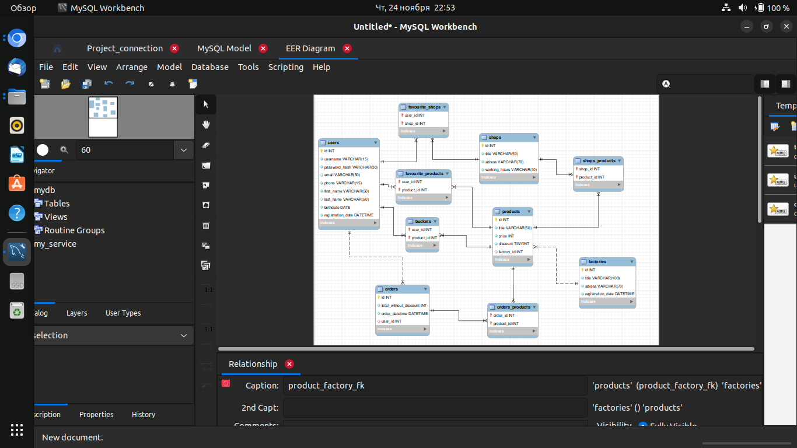

# Simple-database-MySQL
## База данных, созданая при помощи СУБД MySql 
MySql, создание и нормализация таблиц, анализ зависимостей и связей.

## my_service_diagram - диаграма, сделанная на сайте https://app.diagrams.net/ 

А так же, прикрепляю скриншот из MySQLWorkbench:

